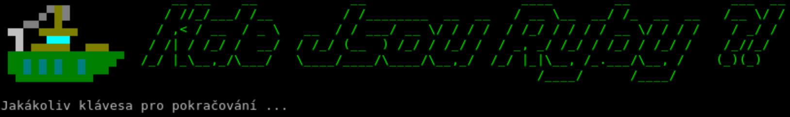
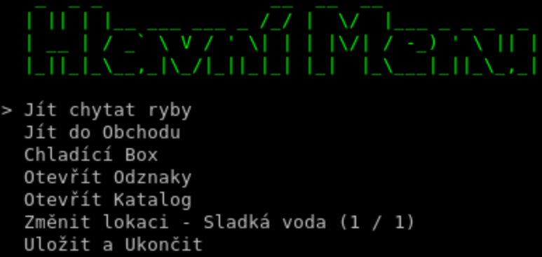
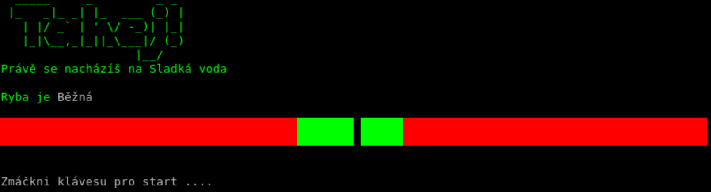
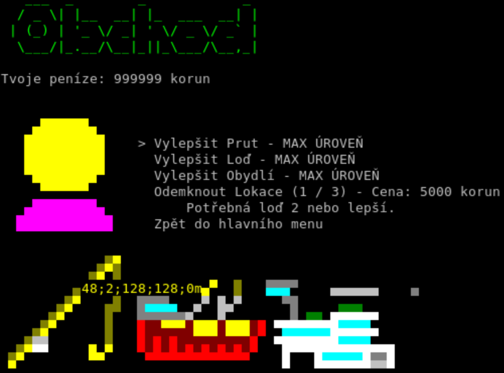
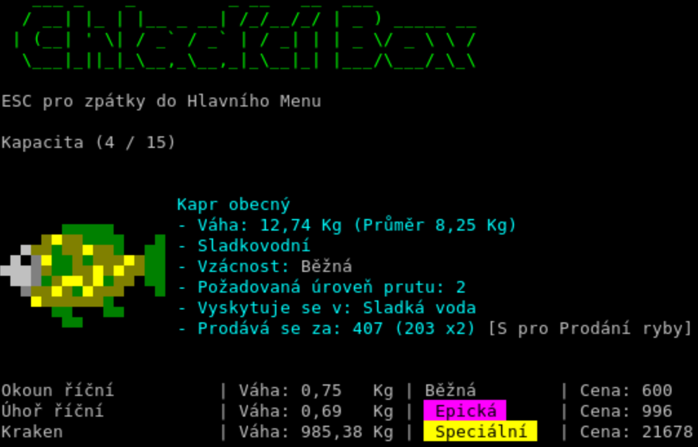
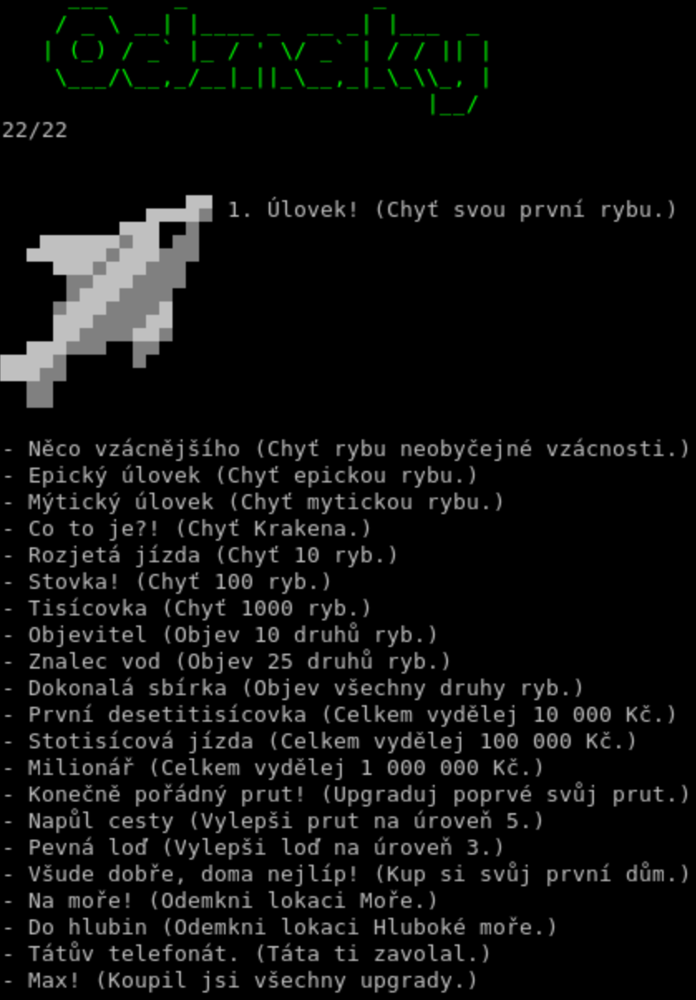
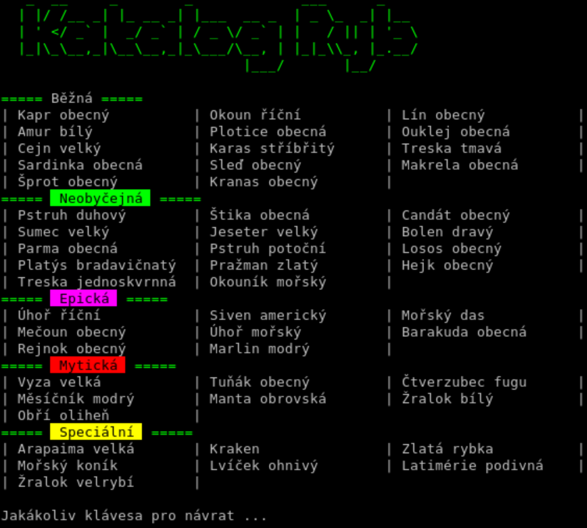

# 🎣 Kde Jsou Ryby?!

Tento projekt je založený na `Honz12/fishing-cs-hackathon`


**Kde Jsou Ryby?!** je konzolová textová rybářská hra napsaná v C# s barevnou ANSI grafikou přímo v terminálu. Chytej ryby, vylepšuj vybavení a dokaž tátovi, že rybaření má smysl!



---

## 📸 Ukázky ze hry

| | |
|---|---|
|  |  |
|  |  |
|  |  |

*Přehled obrazovek hry — hlavní menu, minihra rybaření, obchod, chladicí box, odznaky a katalog ryb.*

---

## 📖 O hře

Hráč se ocitá v roli mladého rybáře, který se rozhodne jít za svým snem i přes otcovo nesouhlas. Pomocí minihry s pohybujícím se kurzorem chytáš ryby, které se zobrazují jako **16×16 pixelové ANSI obrázky** — přímo v terminálu!

Hra obsahuje **50 druhů ryb** (sladkovodní, mořské a z hlubokého moře) + tajný **Kraken**, každá s vlastní vahou, raritou a požadavky na výbavu.

### Herní smyčka

```
Hlavní menu
 ├── 🎣 Jít chytat ryby — minihra s pohyblivým ukazatelem
 ├── 🏪 Jít do obchodu — nákup vylepšení (prut, loď, dům, lokace)
 ├── 📦 Chladicí box — přehled a prodej chycených ryb
 ├── 🏅 Otevřít Odznaky — sbírka odznaků za úspěchy
 ├── 📖 Otevřít Katalog — přehled objevených druhů ryb
 ├── 🗺️ Změnit lokaci — Sladká voda / Moře / Hluboké moře
 └── 💾 Uložit a Ukončit
```

### 🎮 Minihra

Rybaření probíhá v reálném čase:
- Uprostřed lišty je **zelené pole** — v něm musíš udržet kurzor
- **Červená pole** po stranách — kurzor zde znamená ztrátu progresu
- Ryba táhne a zelené pole se pohybuje — čím vzácnější ryba, tím rychleji
- Klávesou **jakéhokoliv písmena** skáče kurzor dopředu
- Vyhráváš, když naplníš ukazatel progresu

### 🐟 Ryby

| Rarita | Barva | Příklady |
|---|---|---|
| Běžná | ⬜ | Kapr, Okoun, Lín |
| Neobyčejná | 🟩 | Pstruh, Štika, Candát |
| Epická | 🟪 | Úhoř, Mořský ďas, Mečoun |
| Mytická | 🟥 | Vyza, Tuňák, Žralok bílý |
| Speciální | 🟨 | Kraken 🦑, Zlatá rybka, Mořský koník |

### 🛒 Obchod

V obchodě můžeš utrácet peníze za:

| Vylepšení | Max úroveň | Efekt |
|---|---|---|
| 🎣 **Prut** | 11 (0–10) | Odemyká vzácnější ryby |
| 🚢 **Loď** | 5 (0–4) | Zvětšuje chladicí box |
| 🏠 **Obydlí** | 5 (0–4) | Postup v příběhu, větší výdělek |
| 🗺️ **Lokace** | 3 | Odemyká Moře a Hluboké moře (vyžaduje loď) |

Po koupi vily (obydlí úroveň 5) se odemkne **závěrečná scéna**.

---

## 🚀 Jak spustit

### Požadavky

- [.NET 10.0 SDK](https://dotnet.microsoft.com/download/dotnet/10.0) nebo novější
- Terminál podporující ANSI escape sekvence (Windows Terminal, GNOME Terminal, iTerm2 apod.)

### Spuštění

```bash
# Naklonovat repozitář
git clone https://github.com/Honz12/fishing-cs-revived.git
cd fishing-cs-revived

# Spustit hru
dotnet run
```

### Ovládání

| Klávesa | Akce |
|---|---|
| ⬆ / ⬇ | Pohyb v menu |
| Enter / Mezerník | Potvrzení volby |
| Escape | Zpět / Přeskočit příběh / Ukončit rybaření |
| S | Prodat rybu v chladicím boxu |
| F1 | Otevřít debug konzoli |

---

## 🛠️ Debug konzole (F1)

Pro vývojáře a odvážné hráče:

```
>>> money 9999
>>> upgrade rod 5
>>> upgrade ship 3
>>> upgrade house 2
>>> help
>>> quit
```

---

## 📁 Struktura projektu

```
src/
├── Program.cs          — Hlavní smyčka hry, vykreslování, minihra
├── Advancements.cs     — Odznaky a jejich podmínky
├── SaveGameHandler.cs  — Ukládání a načítání hry (~/kjr/save.json)
├── Sound.cs            — Přehrávání zvukových efektů
├── Fish.cs             — Třída ryby
├── Image.cs            — Načítání a vykreslování ANSI grafiky
├── Ui/
│   ├── MainMenu.cs     — Hlavní menu
│   ├── CommandProc.cs  — Debug konzole (F1)
│   ├── Shop.cs         — Obchod a vylepšení
│   ├── Inventory.cs    — Chladicí box
│   ├── AdvancementUi.cs— Obrazovka odznaků
│   └── CatalogUi.cs    — Katalog ryb
├── data/
│   ├── TFish.cs        — Šablona ryby a enum FishRarity / FishLocation
│   ├── TFishFinder.cs  — Náhodný výběr ryby
│   └── FishData.cs     — Databáze všech ryb
└── assets/
    ├── audio/          — Zvukové efekty (.wav)
    └── images/
        ├── fish/       — 16×16 pixel art ryb (.img)
        ├── rod/        — Obrázky prutů
        ├── ship/       — Obrázky lodí
        ├── characters/ — Obrázky postav (prodavači)
        ├── houses/     — Obrázky obydlí
        └── advancements/ — Ikony odznaků
```

---

## 👥 Autoři

| Jméno | Role |
|---|---|
| **Honz12** 🧑‍💻 | Hlavní programátor — herní mechaniky, minihra, vykreslování |
| **matejalbert** ✍️ | Obchod, data ryb, texty, README, tutoriál a příběh |
| **sebastianjecny-green** 🎨 | Pixel art — ryby, pruty, lodě a další grafika |

---

## 📜 Licence

Tento projekt je licencován pod MIT licencí — podrobnosti viz soubor [LICENSE](LICENSE).

---

*"A teď už vím, kde ty ryby jsou!"* 🐟
